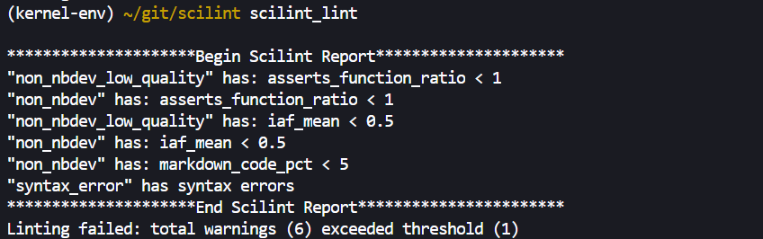
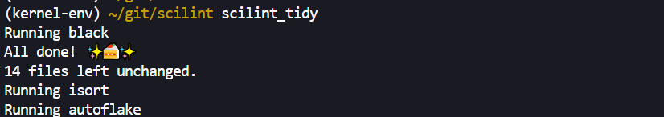
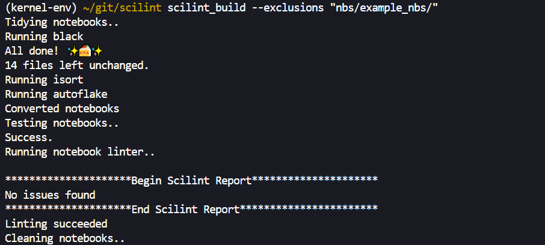
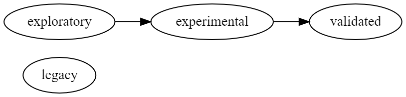
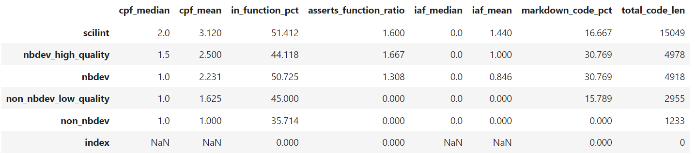
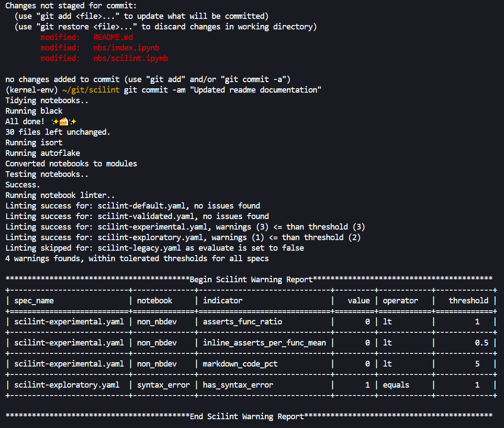

# 🧐 `scilint`

<!-- WARNING: THIS FILE WAS AUTOGENERATED! DO NOT EDIT! -->

`scilint` aims to **bring a style and quality standard into notebook
based Data Science workflows**. How you define a quality notebook is
difficult and somewhat subjective. It can have the obvious meaning of
being free of bugs but also legibility and ease of comprehension are
important too.

`scilint` takes the approach of breaking down potentially quality
relevant aspects of the notebook and providing what we believe are
sensible defaults that potentially correlate with higher quality
workflows. We also let users define the quality line as they see fit
through configuration of existing thresholds and ability to add new
metrics (coming soon). As use of the library grows we anticipate being
able to statistically relate some of the quality relevant attributes to
key delivery metrics like “change failure rate” or “lead time to
production”.

# 🤔 Why do I need quality notebooks?

*If you prefer to move out of notebook-based workflows, post-exploration
to an IDE+Python mix I encourage you to have another ponder on the
benefits of staying in a notebook-based workflow. Notebooks have a
strong visual emphasis and proximity to data. They are also the primary
axis of change within Data Science - new ideas are gained from diving
into data. So instead of packing up your code, re-writing it for
elsewhere and all the waste that entails bring quality to your
exploration workflow and spend more time building stuff that matters.*

If you’re still not convinced watch this
[video](https://www.youtube.com/watch?v=9Q6sLbz37gk) where **Jeremy
Howard** does a far better job of explaining why notebooks are for
serious development too!

# ✅ What is Notebook Quality?

This is a good question and this library does not pretend to have the
answer. But we feel the problem space is worth exploring because the
value of high quality deliveries means lower time-to-market, less time
in re-work or rote porting of code and frees people up to think about
and solve hard problems. That said, there are some practices that we
have observed producing “better” notebooks workflows from experience in
production Data Science teams. These are:

- **Extracting code to small modular functions**
- **Testing those functions work in a variety of scenarios**
- Putting sufficient **emphasis on legibility and ease of
  comprehension** through adequate use of markdown

These are the starting premises that permit the notebook quality
conversation to start. To bring this to life a little, we would say that
**the notebook on the left is of lower quality than the notebook on the
right**..

# 🚀 Getting Started

> Please note `scilint` is only tested on linux and macos currently.

## Install

`pip install scilint`

## Commands

### **[`scilint_lint`](https://newday-data.github.io/scilint/scilint.html#scilint_lint)**

Exposes potential quality issues within your notebook using some
pre-defined checks. Default threshold values for these checks are
provided that will enable a build to be marked as passed or failed.

<b>Show parameters</b>

#### `--fail_over`

> For now a very basic failure threshold is set by providing a number of
> warnings that will be accepted without failing the build. The default
> is 1 but this can be increased via the `--fail_over` parameter. As the
> library matures we will revisit adding more nuanced options.

#### `--exclusions`

> You can exclude individual notebooks or directories using the
> `--exclusions` parameter. This is a comma separated list of paths
> where you can provide directories like “dir/” or specific notebooks
> like “somenotebook.ipynb”

#### `--display_report`

> Print the lint warnings report as a markdown formatted table.

#### `--out_dir`

> Directory to persist the lint_report, warning_violations and the
> confgiruation used.

#### `--print_syntax_errors`

> The code is parsed using the `ast` module if that parsing fails due to
> syntax errors that is noted in the warning report but the exact syntax
> error is not provided. With this flag the `SyntaxError` reason message
> that failed notebook parsing will be printed to the screen for each
> offending notebook.

### **[`scilint_tidy`](https://newday-data.github.io/scilint/scilint.html#scilint_tidy)**

To get a consistent style across your notebooks you can run
[`scilint_tidy`](https://newday-data.github.io/scilint/scilint.html#scilint_tidy);
this currently runs `autoflake`, `black` and `isort` **in-place across
all of the notebooks in your project**. This function wraps an
opinionated flavour of the excellent
[nbQA](https://github.com/nbQA-dev/nbQA) library.

> ⚠️Note: as this **command runs in-place it will edit your existing
> notebooks**. If you would like to test what this formatting does
> without actually affecting their state then we recommended trying this
> the first time from a clean git state. That way you can stash the
> changes if you are not happy with them.

### **[`scilint_build`](https://newday-data.github.io/scilint/scilint.html#scilint_build)**

Chains existing functions together to form a build script for notebook
based projects. Has two versions which are executed automatically on
detection of whether your project uses `nbdev` or not.

1.  Non-nbdev projects chain these commands:
    [`scilint_tidy`](https://newday-data.github.io/scilint/scilint.html#scilint_tidy),
    [`scilint_lint`](https://newday-data.github.io/scilint/scilint.html#scilint_lint)
2.  `nbdev` projects chain the following commands:
    [`scilint_tidy`](https://newday-data.github.io/scilint/scilint.html#scilint_tidy),
    [nbdev_export](https://nbdev.fast.ai/api/export.html),
    [nbdev_test](https://nbdev.fast.ai/api/test.html),
    [`scilint_lint`](https://newday-data.github.io/scilint/scilint.html#scilint_lint),
    [nbdev_clean](https://nbdev.fast.ai/api/clean.html)

## **[`scilint_ci`](https://newday-data.github.io/scilint/scilint.html#scilint_ci)** \[`nbdev` only\]

Adds documentation generation to
[`scilint_build`](https://newday-data.github.io/scilint/scilint.html#scilint_build).
This requires an `nbdev` project and a working quarto build. Quarto is a
core part of the nbdev system, if you are having trouble installing it,
check out the `nbdev` Github [page](https://github.com/fastai/nbdev).
For more details on the Quarto project, check out their home
[page](https://quarto.org/).

# 📈 Quality Indicators

The below are potential quality indicators that you can use to set a
minimum bar for quality and comprehensibility within your projects.
These are not exhaustive or definite quality indicators - they are a
starting point to open the conversation about what it means to have a
high quality notebook in practice.

1.  Calls-Per-Function (CPF):\*\* compares the **amount of calls to the
    amount of functions**. *Looks for possible relationship between
    function definitions and usage.*
2.  In-Function-Percent (IFP): the **percentage of code that is within a
    function** rather than outside function scope.
3.  Tests-Per-Function-Mean (TPF: the **average number of tests (where
    test==assert) for all functions**. *Mean value so may be dominated
    by outliers.*
4.  Tests-Function-Coverage-Pct (TFC): what **percentage of all
    functions have at least one test**. *Note: this is coverage at
    function-level not line-based coverage.*
5.  MarkdownToCodeRatio (MCP): what is the **ratio of markdown cells to
    code cells**.
6.  TotalCodeLen (TCL): the **total line length** of the notebook code
    cells.
7.  Loc-Per-MD-Section (LPS): the **lines of code per Markdown section**
    header.
8.  SyntaxErrors (SYN): if the code within the notebook has **invalid
    Python syntax**.

> *as already stated there is no definitive answer as to whether any of
> these are low or high quality. However there are reasons to believe
> inituitively that higher or lower values of the above will produce
> higher quality notebooks. There are many questions left to answer,
> like the role of docstrings, comments and type annotations; their
> effectiveness may warrant inclusion but that is an open question at
> the moment. As this library is used and refined with more projects and
> more experimental metrics then these intuitions can evaluated more
> rigorously.*

## ➕ Adding New Indicators

For now post your ideas as a feature request and we can discuss, if
accepted you can provide a PR. We are looking for a more rigorous way
link indicator and effectivess, until that is found discussion is the
best we can do!

# 👓 Quality Specs (& a Quality Standard)

Often in Software Engineering code is both likely to go into production
and likely to continue to be used once it does. In this enviroment it
makes sense for codebases to have a single quality standard. In the
**explore vs exploit** decision making
[trade-off](https://en.wikipedia.org/wiki/Exploration-exploitation_dilemma)
this environment could be classified as **high exploit**.

For problems that are **high explore**, like most Data Science work, we
argue that **a single quality bar is not sufficient**. `scilint`
promotes adopting a *progressive consolidation*\* approach where
exploration code starts with a speed of exploration goal and this may
gradually shift to increase the emphasis on quality and reuse as the
utility of the workflow becomes proven.

This feature is known as “Quality Specs” and it allows multiple
different specifications of quality to exist within a project. The
standard can be a relatively low bar for exploration work but can become
more demanding as you are closer to the productionisation of your work.

\**(term first used by [Gaël Varoqouax](https://gael-varoquaux.info/);
see
[here](https://gael-varoquaux.info/programming/software-for-reproducible-science-lets-not-have-a-misunderstanding.html)
for argument expansion).*

## Reference Quality Standard

> The progressive consolidation workflow that we use on projects is the
> reference implementation for `scilint` and is summarised in the below
> image:

- **Legacy:** especially on larger projects there may be a large number
  of legacy notebooks that are not in use and no there is no obvious
  value in improving their quality. This could be removed from the
  workflow if you have enforced a quality standard from the outset.
- **Exploratory:** exploratory workflows are typically off-line and
  involve much iteration. The benefit of some quality bar here is that
  it aids collaboration, review and generally helps perform team-based
  Data Science easier.
- **Experimental:** we split production workflows into two groups:
  experimental and validated. Experimental notebooks are, as the name
  suggests, experiments that are yet to be proven. As they are released
  to customers they should have a reasonably high quality standard but
  not the same as validated work.
- **Validated:** we need to have the most confidence that all validated
  learning activity (experiments which have been accepted and scaled out
  to all users) will run properly for along time after it is written.

## What is a Quality Spec in practice?

A quality spec in practice is just a yaml configuration file of the
properties of the quality spec. It contains threshold values for warning
along with some other settings. To adopt a multi-spec standard place a
spec file into each directory that you want to have different standards
for. Look at `nbs/examples/nbs` to see an example of a multi-spec
standard.

    ---
      exclusions: ~
      fail_over: 1
      out_dir: "/tmp/scilint/"
      precision: 3
      print_syntax_errors: false
      evaluate: true
      warnings:
        lt:
          calls_per_func_median: 1
          calls_per_func_mean: 1
          in_func_pct: 20
          tests_func_coverage_pct: 20
          tests_per_func_mean: 0.5
          markdown_code_pct: 5
        gt:
          total_code_len: 50000
          loc_per_md_section: 2000
        equals:
          has_syntax_error: true

## What does a lint report look like?

The lint warnings are printed to the console and a more thorough report
is generated and saved as a CSV file which looks like this:

# 🔁 Changing Behaviour - Recommended Usage

Infusing quality into workflows is aided by having timely, short-cycle
feedback of issues. Addtionally whatever quality bar you choose as a
team, it should be non-negotiable that way you can spend time thinking
about what matters like the problem you are trying to solve not
nitpicking on small details repeatedly.

We recommend using `scilint` in the following way to maximise benefit:

1.  Decide upon a quality standard including the different specs for
    your ideal team workflow from idea to production - or just use the
    reference standard of:
    `legacy, exploratory=>experimental=>validated`. If you don’t want
    the complexity of a multi-spec standard you can just use a single
    default spec.
2.  Set `fail_over` to 1 - there is a temptation to slide this value to
    meet the amount of warning you have - it is probably easier to
    enforce a `fail_over` of 1 and to discuss the value of the
    thresholds instead if you feel the warning is not warranted.
3.  Open a terminal environment alongside your notebook environment: run
    [`scilint_build`](https://newday-data.github.io/scilint/scilint.html#scilint_build)
    often to check your project is in good shape
4.  Add pre-commit hooks to run
    [`scilint_build`](https://newday-data.github.io/scilint/scilint.html#scilint_build)
    or
    [`scilint_ci`](https://newday-data.github.io/scilint/scilint.html#scilint_ci)
    (`nbdev` only) before your changes are commited. Don’t forget to
    commit your work often!
5.  Add a CI build job that runs
    [`scilint_build`](https://newday-data.github.io/scilint/scilint.html#scilint_build)
    or
    [`scilint_ci`](https://newday-data.github.io/scilint/scilint.html#scilint_ci).
    A Github action workflow is included in this repo that does just
    that.

# 🙌 Standing on the shoulders of giants - *an nbdev library*

> `scilint` is written on top of the excellent `nbdev` library. This
> library is revolutionary as it truly optimises all the benefits of
> notebooks and compensates for most of their weaker points. For more
> information on `nbdev` see the [homepage](https://nbdev.fast.ai/) or
> [github repo](https://github.com/fastai/nbdev)

## 🤓 Make the switch to `nbdev`!

In case you hadn’t guessed yet we are big `nbdev` fans. `scilint` has a
better developer experience on an `nbdev` project and is more fully
featured but mostly because it will really help you when trying to move
from exploratory development to production processes.

Converting your libraries to `nbdev` is not required for this tool to
work but we argue that it would confer many benefits if you are part of
a Production Data Science team. `nbdev` contains many features that are
useful for Data Science workflows; too many in fact to cover here. We
will focus on the major features we consider to have the most impact:

1.  Explicit **separation of exploration from what is *fundamental* for
    the workflow to execute** using the `export` directive.
2.  Introducing a fit-for-purpose **test runner for notebooks**.
3.  **In-flow documentation** of a notebook that is focused on the
    reader and powerfully expressive thanks to Quarto Markdown (aids
    building towards published reproducible research)
4.  **Git friendly workflow** via pre-commit hooks.
5.  Being able to build a **modular notebook workflow as it is easy to
    export and import functions from notebooks** in your project - this
    puts shared reusable functions within reach of the team easily.

# 👍 Contributing

After you clone this repository, please run `nbdev_install_hooks` in
your terminal. This sets up git hooks, which clean up the notebooks to
remove the extraneous stuff stored in the notebooks (e.g. which cells
you ran) which causes unnecessary merge conflicts.

To run the tests in parallel, launch nbdev_test.

Before submitting a PR, check that the local library and notebooks
match.

If you made a change to the notebooks in one of the exported cells, you
can export it to the library with nbdev_prepare. If you made a change to
the library, you can export it back to the notebooks with nbdev_update.
