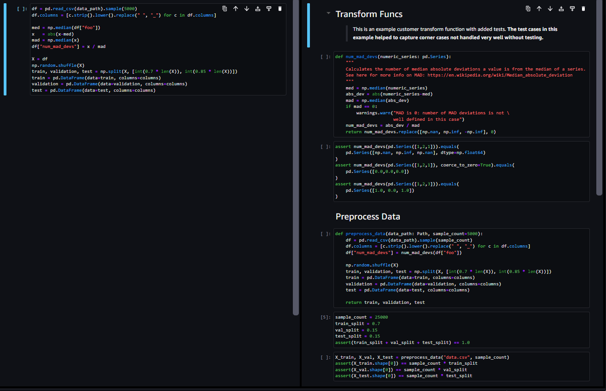

# 🧐 `scilint`

<!-- WARNING: THIS FILE WAS AUTOGENERATED! DO NOT EDIT! -->

`scilint` aims to **bring a style and quality standard into notebook
based Data Science workflows**. How you define a quality notebook is
difficult and somewhat subjective. It can have the obvious meaning of
being free of bugs but also legibility and ease of comprehension are
important too.

`scilint` takes the approach of breaking down potentially quality
relevant aspects of the notebook and providing what we believe are
sensible defaults that potentially correlate with higher quality
workflows. We also let users define the quality line as they see fit
through configuration of existing thresholds and ability to add new
metrics. As use of the library grows we anticipate being able to
statistically relate some of the quality relevant attributes to key
delivery metrics like “change failure rate” or “lead time to
production”.

# Standing on the shoulders of giants - *an nbdev library*

> `scilint` is written on top of the excellent `nbdev` library. This
> library is revolutionary as it truly optimises all the benefits of
> notebooks and compensates for some of their weaker points. Converting
> your libraries to `nbdev` is not required for this tool to work but we
> argue that it would confer many benefits if you are part of a
> Production Data Science team. For more information on `nbdev` see the
> [homepage](https://nbdev.fast.ai/) or [github
> repo](https://github.com/fastai/nbdev)

# ✅ What is Notebook Quality?

This is a good quesiton and this library does not pretend to have the
answer. But we feel the problem space is worth exploring because the
value of high quality deliveries means lower time-to-market, less time
in re-work or rote porting of code and frees people up to think about
and solve hard problems.

That said, here is a very basic starting point where we would say that
**the notebook on left is of lower quality than the notebook on the
right**..

# 🚀 Getting Started

`pip install scilint`

## **[`scilint_lint`](https://newday-data.github.io/scilint/scilint.html#scilint_lint)**

Exposes potential quality issues within your notebook using some
pre-defined checks. Default threshold values for these checks are
provided that will enable a build to be marked as passed or failed.

## **[`scilint_tidy`](https://newday-data.github.io/scilint/scilint.html#scilint_tidy)**

To get a consistent style across your notebooks you can run
[`scilint_tidy`](https://newday-data.github.io/scilint/scilint.html#scilint_tidy);
this currently runs `autoflake`, `black` and `isort` in-place across all
of your notebooks.

## **[`scilint_build`](https://newday-data.github.io/scilint/scilint.html#scilint_build)**

Has two versions which are executed automatically on detection of
whether your project uses `nbdev` or not.

1.  Non-nbdev projects chain these commands:
    [`scilint_tidy`](https://newday-data.github.io/scilint/scilint.html#scilint_tidy),
    [`scilint_lint`](https://newday-data.github.io/scilint/scilint.html#scilint_lint)
2.  `nbdev` projects chain the following commands:
    [`scilint_tidy`](https://newday-data.github.io/scilint/scilint.html#scilint_tidy),
    [nbdev_export](https://nbdev.fast.ai/api/export.html),
    [nbdev_test](https://nbdev.fast.ai/api/test.html),
    [`scilint_lint`](https://newday-data.github.io/scilint/scilint.html#scilint_lint),
    [nbdev_clean](https://nbdev.fast.ai/api/clean.html)

## **[`scilint_ci`](https://newday-data.github.io/scilint/scilint.html#scilint_ci)** \[`nbdev` only\]

Adds documentation generation to
[`scilint_build`](https://newday-data.github.io/scilint/scilint.html#scilint_build).
This requires an `nbdev` project and a working quarto build.

## Potential Quality Indicators

The below are potential quality indicators that you can use to set a
minimum bar for quality and comprehensibility within your projects.
These are not exhaustive or definite quality indicators - they are a
starting point to open the conversation about what it means to have a
high quality notebook in practice.

1.  **Calls-Per-Function {Median, Mean}:** compares the amount of calls
    to the amount of functions. Looks for possible reletatioship between
    function definitions and usage.
2.  **In-Function-Percent:**: the percentage of code that is within a
    function rather than outside function scope.
3.  **Asserts-Per-Function:** looks at how many tests (where assert =
    test) there are compared to the total function count.
4.  **InlineAssertsPerFunction {Median, Mean}:** examines how many times
    a function is called within an assert statement - this aims to see
    testing of functions not just usage.
5.  **MarkdownToCodeRatio:** what is the ratio of markdown cells to code
    cells.
6.  **TotalCodeLen**: the total line length of the notebook.
7.  **SyntaxErrors**: if the code within the notebook has invalid Python
    syntax.

> Note: the amove metrics are a starting point for trying to reason
> about notebook quality from some properties of the code and markdown
> within them. There is no definitive answer as to whether any of these
> are low or high quality. However there are reasons to believe
> inituitively that higher or lower values of the below will produce
> higher quality notebooks. There are many questions left ot answer,
> like the role of docstrings and comments, their effectiveness may
> warrant inclusion but that is an open quesiton at the moment. As this
> library is used and refined with more projects and more experimental
> metrics then these intuitions can evaluated more rigorously.

### What does a lint report look like?

# ⚙️ Configuring `scilint`

Run `scilint -h` to see more detailed options including the ability to
set warning thresholds and customise various options of the linter.

### Fail Threshold (`--fail_over`)

> For now a very basic failure threshold is set by providing a number of
> warnings that will be accepted without failing the build. The default
> is 1 but this can be increased via the `--fail_over` parameter. As the
> library matures we will revisit adding more nuanced options.

## Exclusion (`--exclusions`)

> You can exclude individual notebooks or directories using the
> `--exclusions` parameter. This is a comma separated list of paths
> where you can provide directories like “dir/” or specific notebooks
> like “somenotebook.ipynb”

# 👍 Contributing

After you clone this repository, please run nbdev_install_hooks in your
terminal. This sets up git hooks, which clean up the notebooks to remove
the extraneous stuff stored in the notebooks (e.g. which cells you ran)
which causes unnecessary merge conflicts.

To run the tests in parallel, launch nbdev_test.

Before submitting a PR, check that the local library and notebooks
match.

If you made a change to the notebooks in one of the exported cells, you
can export it to the library with nbdev_prepare. If you made a change to
the library, you can export it back to the notebooks with nbdev_update.

# 🤓 Start using `nbdev`!

In case you hadn’t guessed yet we are big `nbdev` fans. `scilint` has a
better developer experience on an `nbdev` project and is more fully
featured but mostly because it will really help you when trying to move
from exploratory development to production processes.

`nbdev` contains many features that are useful for Data Science
workflows; too many in fact to cover here. We will focus on the major
features we consider to have significant for Production Data Science
teams:

1.  Explicit separation of exploration from what is **fundamental** for
    the workflow to execute using the `export` directive.
2.  Introducing a test runner for notebook-based repos.
3.  In-flow documentation of a notebook that is focused on the reader
    and powerfully expressive thanks to Quarto Markdown (aids building
    towards published reproducible research)
4.  Git friendly workflow via pre-commit hooks.
