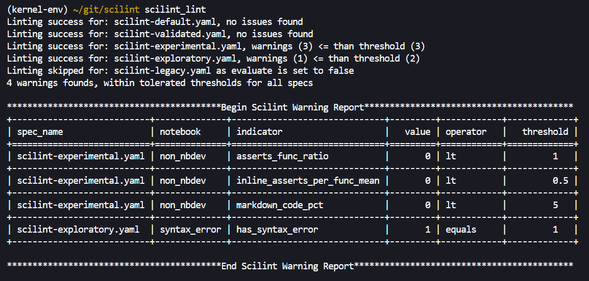
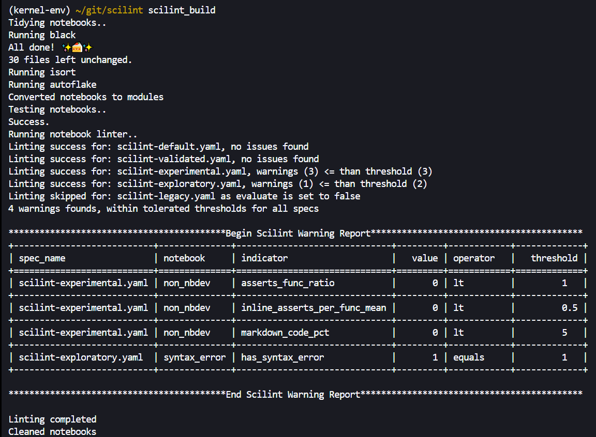

# 🧐 `scilint`

<!-- WARNING: THIS FILE WAS AUTOGENERATED! DO NOT EDIT! -->

`scilint` aims to **bring a style and quality standard into notebook
based Data Science workflows**. How you define a quality notebook is
difficult and somewhat subjective. It can have the obvious meaning of
being free of bugs but also legibility and ease of comprehension are
important too.

`scilint` takes the approach of breaking down potentially quality
relevant aspects of the notebook and providing what we believe are
sensible defaults that potentially correlate with higher quality
workflows. We also let users define the quality line as they see fit
through configuration of existing thresholds and ability to add new
metrics (coming soon). As use of the library grows we anticipate being
able to statistically relate some of the quality relevant attributes to
key delivery metrics like “change failure rate” or “lead time to
production”.

# 🤔 Why do I need quality notebooks?

*If you prefer to move out of notebook-based workflows, post-exploration
to an IDE+Python mix I encourage you to have another ponder on the
benefits of staying in a notebook-based workflow. Notebooks have a
strong visual emphasis and proximity to data. They are also the primary
axis of change within Data Science - new ideas are gained from diving
into data. So instead of packing up your code, re-writing it for
elsewhere and all the waste that entails bring quality to your
exploration workflow and spend more time building stuff that matters.*

If you’re still not convinced watch this
[video](https://www.youtube.com/watch?v=9Q6sLbz37gk) where **Jeremy
Howard** does a far better job of explaining why notebooks are for
serious development too!

# ✅ What is Notebook Quality?

This is a good question and this library does not pretend to have the
answer. But we feel the problem space is worth exploring because the
value of high quality deliveries means lower time-to-market, less time
in re-work or rote porting of code and frees people up to think about
and solve hard problems. That said, there are some practices that we
have observed producing “better” notebooks workflows from experience in
production Data Science teams. These are:

- Extracting code to functions
- Testing logic as well as data behaviour
- Putting sufficient emphasis on legibility and ease of comprehension
  through adequate use of markdown

These are the starting premises that permit the notebook quality
conversation to start. To bring this to life a little, we would say that
**the notebook on the left is of lower quality than the notebook on the
right**..

# 🚀 Getting Started

> Please note `scilint` is only tested on linux and macos currently.

## Install

`pip install scilint`

## Commands

### **[`scilint_lint`](https://newday-data.github.io/scilint/scilint.html#scilint_lint)**

Exposes potential quality issues within your notebook using some
pre-defined checks. Default threshold values for these checks are
provided that will enable a build to be marked as passed or failed.

<b>Show parameters</b>

#### `--fail_over`

> For now a very basic failure threshold is set by providing a number of
> warnings that will be accepted without failing the build. The default
> is 1 but this can be increased via the `--fail_over` parameter. As the
> library matures we will revisit adding more nuanced options.

#### `--exclusions`

> You can exclude individual notebooks or directories using the
> `--exclusions` parameter. This is a comma separated list of paths
> where you can provide directories like “dir/” or specific notebooks
> like “somenotebook.ipynb”

### **[`scilint_tidy`](https://newday-data.github.io/scilint/scilint.html#scilint_tidy)**

To get a consistent style across your notebooks you can run
[`scilint_tidy`](https://newday-data.github.io/scilint/scilint.html#scilint_tidy);
this currently runs `autoflake`, `black` and `isort` in-place across all
of your notebooks. This function wraps an opinionated flavour of the
excellent [nbQA](https://github.com/nbQA-dev/nbQA) library.

### **[`scilint_build`](https://newday-data.github.io/scilint/scilint.html#scilint_build)**

Chains existing functions together to form a build script for notebook
based projects. Has two versions which are executed automatically on
detection of whether your project uses `nbdev` or not.

1.  Non-nbdev projects chain these commands:
    [`scilint_tidy`](https://newday-data.github.io/scilint/scilint.html#scilint_tidy),
    [`scilint_lint`](https://newday-data.github.io/scilint/scilint.html#scilint_lint)
2.  `nbdev` projects chain the following commands:
    [`scilint_tidy`](https://newday-data.github.io/scilint/scilint.html#scilint_tidy),
    [nbdev_export](https://nbdev.fast.ai/api/export.html),
    [nbdev_test](https://nbdev.fast.ai/api/test.html),
    [`scilint_lint`](https://newday-data.github.io/scilint/scilint.html#scilint_lint),
    [nbdev_clean](https://nbdev.fast.ai/api/clean.html)

## **[`scilint_ci`](https://newday-data.github.io/scilint/scilint.html#scilint_ci)** \[`nbdev` only\]

Adds documentation generation to
[`scilint_build`](https://newday-data.github.io/scilint/scilint.html#scilint_build).
This requires an `nbdev` project and a working quarto build. Quarto is a
core part of the nbdev system, if you are having trouble installing it,
check out the `nbdev` Github [page](https://github.com/fastai/nbdev).
For more details on the Quarto project, check out their home
[page](https://quarto.org/).

## 📈 Potential Quality Indicators

The below are potential quality indicators that you can use to set a
minimum bar for quality and comprehensibility within your projects.
These are not exhaustive or definite quality indicators - they are a
starting point to open the conversation about what it means to have a
high quality notebook in practice.

1.  **Calls-Per-Function (CPF) {Median, Mean}:** compares the amount of
    calls to the amount of functions. Looks for possible relationship
    between function definitions and usage.
2.  **In-Function-Percent (IFP):**: the percentage of code that is
    within a function rather than outside function scope.
3.  **Asserts-Per-Function (APF):** looks at how many tests (where
    assert = test) there are compared to the total function count.
4.  **InlineAssertsPerFunction (IAF) {Median, Mean}:** examines how many
    times a function is called within an assert statement - this aims to
    see testing of functions not just usage.
5.  **MarkdownToCodeRatio (MCP):** what is the ratio of markdown cells
    to code cells.
6.  **TotalCodeLen (TCL)**: the total line length of the notebook.
7.  **SyntaxErrors**: if the code within the notebook has invalid Python
    syntax.

> *Note: there is no definitive answer as to whether any of these are
> low or high quality. However there are reasons to believe inituitively
> that higher or lower values of the below will produce higher quality
> notebooks. There are many questions left ot answer, like the role of
> docstrings and comments, their effectiveness may warrant inclusion but
> that is an open question at the moment. As this library is used and
> refined with more projects and more experimental metrics then these
> intuitions can evaluated more rigorously.*

# Adding New Indicators

*\[coming soon\]* - requires:

- some code refactoring for practical handling of multiple indicators
  (short-term issue)
- an assessment framework for determining effectiveness of indicator
  (slightly more challenging)

### What does a lint report look like?

# 🔁 Changing Behaviour - Recommended Usage

Infusing quality into workflows is aided by having timely, short-cycle
feedback of issues. Addtionally whatever quality bar you choose as a
team, it should be non-negotiable that way you can spend time thinking
about what matters like the problem you are trying to solve not
nitpicking on small details repeatedly.

We recommend using `scilint` in the following way to maximise benefit:

1.  Open a terminal environment alongside your notebook environment: run
    [`scilint_build`](https://newday-data.github.io/scilint/scilint.html#scilint_build)
    often to check your project is in good shape
2.  Add pre-commit hooks to run
    [`scilint_build`](https://newday-data.github.io/scilint/scilint.html#scilint_build)
    or
    [`scilint_ci`](https://newday-data.github.io/scilint/scilint.html#scilint_ci)
    (`nbdev` only) before your changes are commited. Don’t forget to
    commit your work often!
3.  Add a CI build job that runs
    [`scilint_build`](https://newday-data.github.io/scilint/scilint.html#scilint_build)
    or
    [`scilint_ci`](https://newday-data.github.io/scilint/scilint.html#scilint_ci).
    A Github action workflow is included in this repo that does just
    that.

# 🙌 Standing on the shoulders of giants - *an nbdev library*

> `scilint` is written on top of the excellent `nbdev` library. This
> library is revolutionary as it truly optimises all the benefits of
> notebooks and compensates for most of their weaker points.

## 🤓 Start using `nbdev`!

In case you hadn’t guessed yet we are big `nbdev` fans. `scilint` has a
better developer experience on an `nbdev` project and is more fully
featured but mostly because it will really help you when trying to move
from exploratory development to production processes.

Converting your libraries to `nbdev` is not required for this tool to
work but we argue that it would confer many benefits if you are part of
a Production Data Science team. `nbdev` contains many features that are
useful for Data Science workflows; too many in fact to cover here. We
will focus on the major features we consider to have the most impact:

1.  Explicit **separation of exploration from what is *fundamental* for
    the workflow to execute** using the `export` directive.
2.  Introducing a **test runner for notebooks**.
3.  **In-flow documentation** of a notebook that is focused on the
    reader and powerfully expressive thanks to Quarto Markdown (aids
    building towards published reproducible research)
4.  **Git friendly workflow** via pre-commit hooks.
5.  Being able to build a **modular notebook workflow as it is easy to
    export and import functions from notebooks** in your project - this
    puts shared reusable functions within reach of the team easily.

For more information on `nbdev` see the
[homepage](https://nbdev.fast.ai/) or [github
repo](https://github.com/fastai/nbdev)

# 👍 Contributing

After you clone this repository, please run nbdev_install_hooks in your
terminal. This sets up git hooks, which clean up the notebooks to remove
the extraneous stuff stored in the notebooks (e.g. which cells you ran)
which causes unnecessary merge conflicts.

To run the tests in parallel, launch nbdev_test.

Before submitting a PR, check that the local library and notebooks
match.

If you made a change to the notebooks in one of the exported cells, you
can export it to the library with nbdev_prepare. If you made a change to
the library, you can export it back to the notebooks with nbdev_update.
